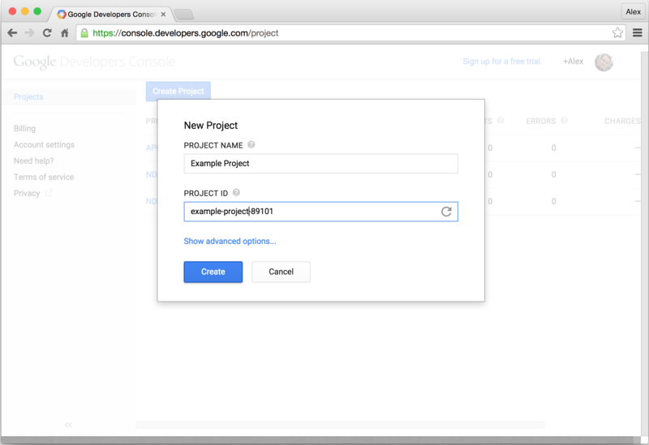
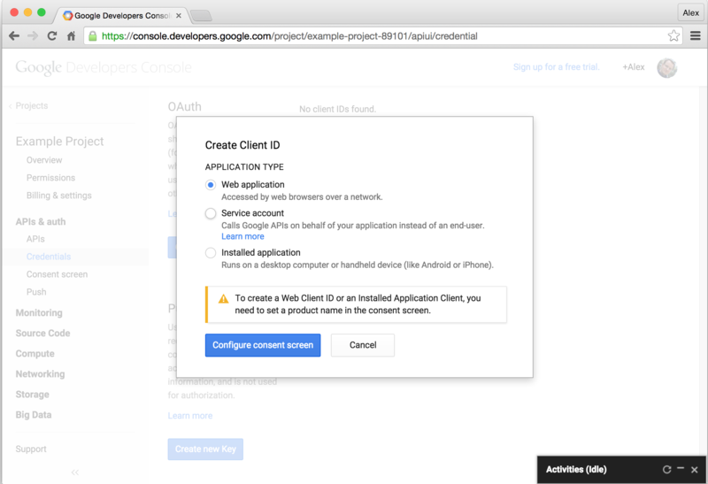
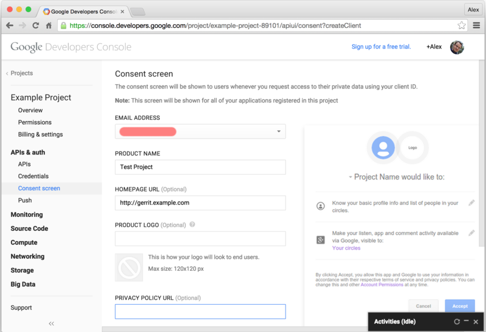
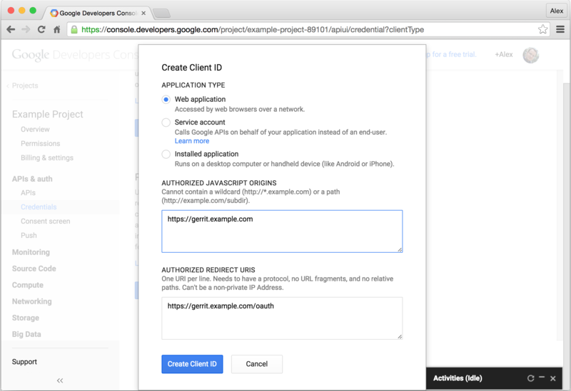
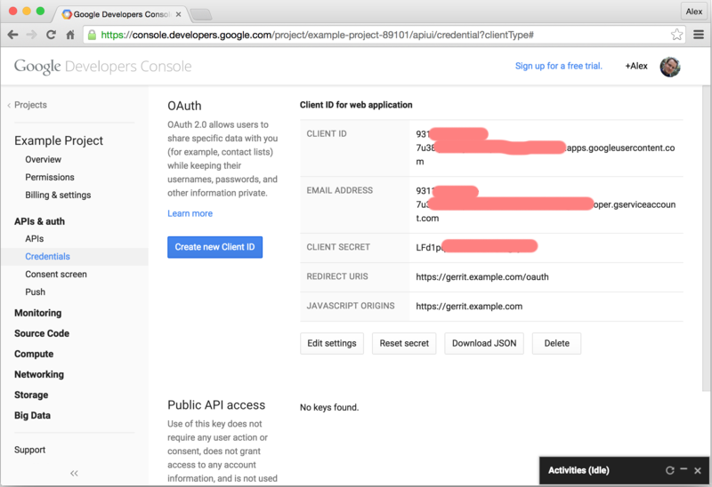
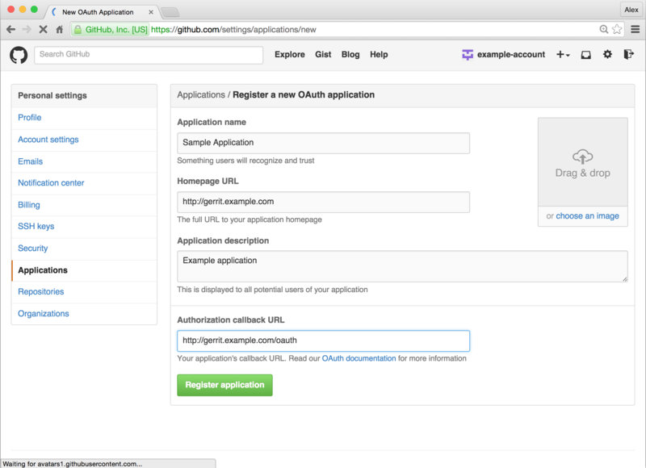
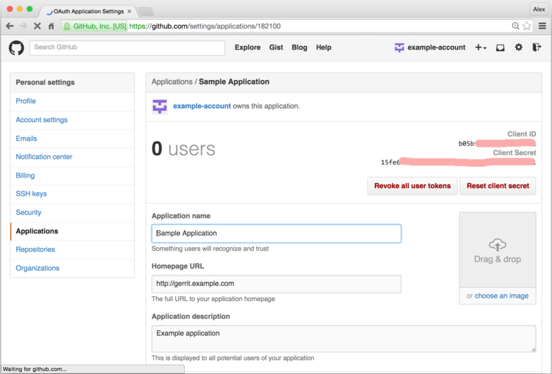
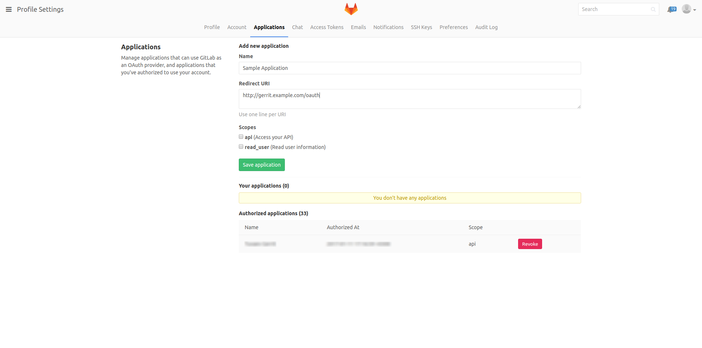
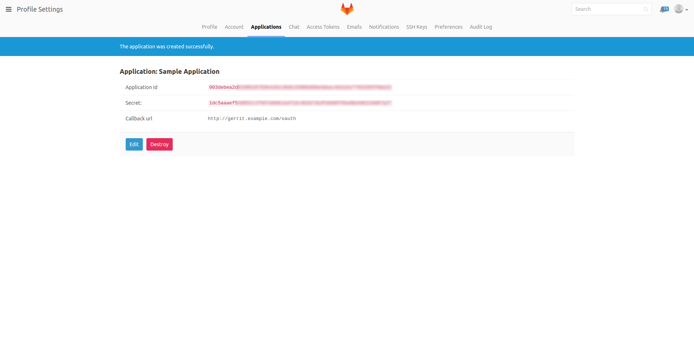

Configuration
=============

The configuration of the @PLUGIN@ plugin is done in the `gerrit.config`
file. `auth.type` must be set to `OAUTH`:

```
[auth]
  type = OAUTH
```

For a per-provider overview of the security-relevant features (Git-over-HTTP,
defense-in-depth checks, user-info mapper, PKCE), see the
[provider capability matrix](providers.md).

Providers are configured under @PLUGIN@ section,
appended with provider suffix: e.g. `-google-oauth` or `-github-oauth`:

```
  [plugin "@PLUGIN@-google-oauth"]
    client-id = "<client-id>"
    client-secret = "<client-secret>"
    link-to-existing-openid-accounts = true
    enable-git-over-http = false # Optional, when true git over HTTPS can authenticate with a Google access token issued for a trusted client (client-id, or a trusted-audience entry). Not compatible with domain. See config-google.md.
    # enable-pkce = true # Optional, when true the browser authorization-code flow uses PKCE.
    # enable-token-refresh = false # Optional, when true request a Google refresh_token (access_type=offline) so an expired browser access token is renewed automatically. See "Token refresh" below.
    # force-consent = false # Optional, with enable-token-refresh: send prompt=consent to force Google to re-issue a refresh_token (Google issues one only on first consent). User-visible on every login; leave off in production.
    # trusted-audience = "<cli-client-id>" # Optional, repeatable: additional Google client-ids (e.g. a Desktop client for git credential helpers) whose tokens the git path accepts. See config-google.md.

  [plugin "@PLUGIN@-github-oauth"]
    root-url = "<github url>" # https://github.com/ or https://git.company.com/
    client-id = "<client-id>"
    client-secret = "<client-secret>"
    enable-git-over-http = false # Optional, when true git over HTTPS can authenticate with a GitHub access token issued for this OAuth app. See config-github.md.
    # enable-pkce = true # Optional, when true the browser authorization-code flow uses PKCE.

  [plugin "@PLUGIN@-cas-oauth"]
    root-url = "<cas url>"
    client-id = "<client-id>"
    client-secret = "<client-secret>"
    use-json-extractor = false
    enable-pkce = true # Optional, when true the browser authorization-code flow uses PKCE (RFC 7636).

  [plugin "@PLUGIN@-gitlab-oauth"]
    root-url = "<gitlab url>"
    client-id = "<client-id>"
    client-secret = "<client-secret>"
    # enable-pkce = true # Optional, when true the browser authorization-code flow uses PKCE.
    # enable-git-over-http = false # Optional, when true git over HTTPS can authenticate with a GitLab access token issued for a trusted app (client-id, or a trusted-audience entry). See config-gitlab.md.
    # required-scope = read_user # Optional, repeatable; scope(s) the Git-over-HTTP token must carry (default read_user). See config-gitlab.md.
    # trusted-audience = "<helper-client-id>" # Optional, repeatable: additional GitLab application ids (e.g. a git credential helper's client) whose tokens the git path accepts. See config-gitlab.md.

  [plugin "@PLUGIN@-dex-oauth"]
    domain = "<domain for username manipulation (optional)>"
    service-name = "<custom service name (optional)>"
    root-url = "<dex url>"
    client-id = "<client-id>"
    client-secret = "<client-secret>"
    # enable-pkce = true # Optional, when true the browser authorization-code flow uses PKCE.

  [plugin "@PLUGIN@-airvantage-oauth"]
    client-id = "<client-id>"
    client-secret = "<client-secret>"
    # enable-pkce = true # Optional, when true the browser authorization-code flow uses PKCE.

  [plugin "@PLUGIN@-phabricator-oauth"]
    client-id = "<client-id>"
    client-secret = "<client-secret>"
    root-url = "<phabricator url>"
    # enable-pkce = true # Optional, when true the browser authorization-code flow uses PKCE.

  [plugin "@PLUGIN@-bitbucket-oauth"]
    client-id = "<client-id>"
    client-secret = "<client-secret>"
    # enable-pkce = true # Optional, when true the browser authorization-code flow uses PKCE.

  [plugin "@PLUGIN@-facebook-oauth"]
    client-id = "<client-id>"
    client-secret = "<client-secret>"
    # enable-pkce = true # Optional, when true the browser authorization-code flow uses PKCE.

  [plugin "@PLUGIN@-azure-oauth"]
    client-id = "<client-id>"
    client-secret = "<client-secret>"
    tenant = "<tenant (optional defaults to organizations if not set)>"
    link-to-existing-office365-accounts = true # Optional, if set will try to link old account with the @PLUGIN@-office365-oauth naming
    # enable-pkce = true # Optional, when true the browser authorization-code flow uses PKCE.
    # enable-git-over-http = false # Optional, when true Git-over-HTTPS can authenticate with an Azure access token that this Gerrit's Azure app minted; the plugin introspects it at Microsoft Graph /me. See the Azure section below.

  [plugin "@PLUGIN@-keycloak-oauth"]
    # Prior to Keycloak V17 /auth path must be added to the root-url, see this migration instruction:
    # https://www.keycloak.org/migration/migrating-to-quarkus
    root-url = "<root url>" # for example, https://signon.example.com, or https://signon.example.com/auth
    realm = "<realm>"
    client-id = "<client-id>"
    client-secret = "<client-secret>"
    use-preferred-username = true # Optional, if false will not send preferred_username from Keycloak to leave username unset
    enable-pkce = true # Optional, when true the browser flow uses PKCE (RFC 7636); required for public clients
    enable-git-over-http = false # Optional, when true git clone/fetch/push over HTTPS can authenticate with a Keycloak access_token. See config-keycloak.md.

  # Auth0, Authentik, Cognito, LemonLDAP::NG and Tuleap no longer have dedicated
  # sections. They are generic OpenID Connect providers and have been removed in
  # favour of the @PLUGIN@-discovery-oauth section below; see config-discovery.md
  # for a per-provider migration recipe that preserves existing external ids.

  [plugin "@PLUGIN@-sapias-oauth"]
    root-url = "<root url>" # for example, https://sapias.example.com
    client-id = "<client-id>"
    client-secret = "<client-secret>"
    link-to-existing-gerrit-accounts = false
    enable-pkce = true
    enable-git-over-http = true # SAP IAS is grandfathered on; set false to disable Git-over-HTTP.
    enable-resource-owner-password-flow = false

  [plugin "@PLUGIN@-discovery-oauth"]
    root-url = "<root url>" # The part before /.well-known. for example, https://kanidm.example.com/oauth2/openid/gerrit
    client-id = "<client-id>"
    client-secret = "<client-secret>"
    enable-pkce = true
    enable-git-over-http = false # Optional, when true git over HTTPS can authenticate with an IdP-signed JWT whose aud is this client-id. Requires the discovery document to expose jwks_uri. See config-discovery.md.
    # external-id-scheme = discovery-oauth # Optional; the external-id scheme (default discovery-oauth). Set it to a removed wrapper's scheme (e.g. auth0-oauth) to migrate that provider to Discovery without unlinking accounts. See config-discovery.md.
    # link-to-existing-gerrit-accounts = false # Optional; when true the browser flow sets a gerrit:<username> claimed identity to link a first login to an existing account (matches Authentik/Cognito). See config-discovery.md.
    # client-auth-method = basic # Optional; token-endpoint client auth: basic (HTTP Basic, default) or request-body (client_id/client_secret in the POST body, e.g. a default LemonLDAP::NG). See config-discovery.md.
```

When only one of the sections above is configured, OAuth SSO is used directly and
the login form with provider selection isn’t shown. When all sections are omitted,
Gerrit will not start.

Google OAuth provider seamlessly supports linking of OAuth identity
to existing OpenID accounts. This feature is deactivated by default.
To activate it, add

```
plugin.gerrit-oauth-provider-google-oauth.link-to-existing-openid-accounts = true
```

to Google OAuth configuration section.

It is possible to restrict sign-in to accounts of one or more (hosted) domains for
Google OAuth. Multiple `domain` options can be added:

```
plugin.gerrit-oauth-provider-google-oauth.domain = "mycollege.edu"
plugin.gerrit-oauth-provider-google-oauth.domain = "myschool.net"
```

See [the spec](https://developers.google.com/identity/protocols/OpenIDConnect#hd-param)
for more information. To protect against client-side request modification, the returned
ID token is checked to contain a matching hd claim (which is proof the account does belong
to the hosted domain). If the hd claim wasn't included in ID token or didn't match the
provided `domain` configuration option the authentication is rejected. Note: because of a
current limitation of the OAuth extension point in Gerrit, the user would only see an
"Unauthorized" message.

By default the Google OAuth provider will not set a username (used for ssh) and
the user can choose one from the web ui (needed before using ssh). It is possible
to automatically use the user part from the google apps email. This is deactivated
by default. To activate it, add:

```
plugin.gerrit-oauth-provider-google-oauth.use-email-as-username = true
```

Note: the usernames are unique in gerrit. If a username already exists this will
be ignored and the user will have to choose a different one from the web ui.

### CAS OAuth

For CAS OAuth setting

```
plugin.gerrit-oauth-provider-cas-oauth.root-url = "https://example.com/cas"
```

is required, since CAS is a self-hosted application.

Note that the CAS OAuth plugin only supports CAS V5 and higher. Both plain text
and JSON responses are supported (see configuration).

The plugin expects CAS to make several attributes available to it:

| Name | Description | Required |
|---|---|---|
| id | External ID | yes |
| login | Login name | no |
| email |  Email address | no |
| name | Display name | no |

### CoreOS Dex OAuth

For Dex OAuth setting

```
plugin.gerrit-oauth-provider-dex-oauth.root-url = "https://example.com"
```

is required, since Dex is a self-hosted application.

The Dex `id_token` is verified against Dex's JWKS: its signature, `aud` ==
`client-id`, `exp`, and issuer are checked before its claims are trusted. Dex is
mounted under `/dex` (its endpoints are `<root-url>/dex/auth` and
`<root-url>/dex/token`), so the issuer is `<root-url>/dex` and the JWKS is
`<root-url>/dex/keys`; Gerrit must be able to reach the latter. If `client-id` is
unset the check is disabled and the token is decoded unsigned (prior behavior).

## Obtaining provider authorizations

### Google

To obtain client-id and client-secret for Google OAuth, go to
[Google Developers Console](https://console.developers.google.com):

- Create a project

  

- Go inside the created project

- In "APIs & auth"/"Credentials" select "Create new Client ID" and
create Client ID for a Web application

  

- Enter additional information about the project, which will be
  presented to user during the authentication process

  

- Specify authorized redirect URL: `<canonical-web-uri-of-gerrit>/oauth`

  

After the final step, the page will show generated client id and
secret.



#### Token refresh

`enable-token-refresh = true` requests a Google refresh token (via
`access_type=offline`) so an expired access token can be renewed instead of
forcing a re-login. An expired token is renewed on read: browser/REST reads
(`GET /accounts/{id}/oauthtoken`) and the core `oauth-token` SSH command both
refresh it via `OAuthTokenRefresher`; it needs only `enable-token-refresh` on
the issuing provider, not `enable-git-over-http`. Renewal happens at retrieval
time, not during a Git-over-HTTP request, which validates the presented token
as-is. `force-consent = true` additionally sends `prompt=consent` to make
Google re-issue a refresh token (Google returns one only on the first consent);
it is user-visible on every login, so leave it off in production.

**Security -- stored refresh tokens.** Enabling token refresh persists
long-lived refresh tokens in Gerrit's `oauth_tokens` cache
(`<review_site>/cache/oauth_tokens-*.mv.db`). By default this cache is stored in
**cleartext** (as access tokens have been since the cache was introduced). To
encrypt the stored token/secret/raw fields, generate a base64-encoded AES key
of 16, 24 or 32 raw bytes (128/192/256-bit -- the number is the byte count, not
the base64 string length):

```
  openssl rand -base64 32              # AES-256 (recommended)
  # or, without openssl:
  head -c 32 /dev/urandom | base64
```

and set the output as the **core** key (see
`config-gerrit.html#auth.tokenEncryptionKey`):

```
  [auth]
    tokenEncryptionKey = <paste the base64 output here>
```

Gerrit core then binds an AES-GCM `OAuthTokenEncrypter`, so tokens are encrypted
before they are written to the cache and decrypted on read; tokens cached before
the key was set keep working (read as cleartext until rewritten). Keep the key
secret and back it up -- losing it makes the cached tokens unreadable. When
`auth.type = OAUTH` and no key is set, core logs a warning at startup that tokens
are persisted in cleartext; restrict filesystem access to `review_site/cache`, or
set `enable-token-refresh = false`, if that is unacceptable.

### GitHub

To obtain client-id and client-secret for GitHub OAuth, go to
[Applications settings in your GitHub account](https://github.com/settings/applications):

- Select "Register new application" and enter information about the
  application.

  Note that it is important that authorization callback URL points to
  `<canonical-web-uri-of-gerrit>/oauth`.

  


After application is registered, the page will show generated client id and
secret.



### CAS

The client-id and client-secret for CAS OAuth are part of the CAS
service definition and need to be set manually.

See
[the CAS documentation](https://apereo.github.io/cas/4.2.x/installation/OAuth-OpenId-Authentication.html#add-oauth-clients)
for an example.

### GitLab

To obtain client-id and client-secret for GitLab OAuth, go to
Applications settings in your GitLab profile:

- Select "Save application" and enter information about the
  application.

  Note that it is important that Redirect URI points to
    `<canonical-web-uri-of-gerrit>/oauth`.

  


After application is saved, the page will show generated client id and
secret.



### CoreOS Dex

The client-id and client-secret for Dex OAuth are part of the Dex
setup and need to be set manually.

See
[Using Dex](https://github.com/coreos/dex/blob/master/Documentation/using-dex.md)
for an example.

### AirVantage

The client-id and client-secret for AirVantage OAuth can be obtained by registering
a Client application.
See [Getting Started](https://source.sierrawireless.com/airvantage/av/howto/cloud/gettingstarted_api).

### Phabricator

The client-id and client-secret for Phabricator can be obtained by registering a
Client application.
See [Using the Phabricator OAuth Server](https://secure.phabricator.com/book/phabcontrib/article/using_oauthserver/).

### Azure (previously named Office365)
Azure was previously named Office365. Both `plugin.gerrit-oauth-provider-azure-oauth` and
`plugin.gerrit-oauth-provider-office365-oauth` are supported by the Azure OAuth.
When running *java gerrit.war init* it will check the existing config to see if it finds the old
naming and use that during the init run, if it does not find the `office365-oauth` it will
use the new `azure-oauth` naming.

The client-id and client-secret for Azure can be obtained by registering a new application,
see [OAuth 2.0 and OpenID Connect protocols on Microsoft identity platform](https://docs.microsoft.com/en-us/azure/active-directory/develop/active-directory-v2-protocols).

#### Token refresh
Set `enable-token-refresh = true` (default `false`) to make Azure
refresh-capable; Azure already requests the `offline_access` scope, so a
refresh_token is available with no extra configuration. An expired token is
renewed on read: browser/REST reads (`GET /accounts/{id}/oauthtoken`) refresh
it via `OAuthTokenRefresher` before returning it, and the core `oauth-token`
SSH command refreshes on demand. Both need only `enable-token-refresh` on the
issuing provider, not `enable-git-over-http`. Neither refreshes during a
Git-over-HTTP request, which introspects the presented token at Microsoft
Graph `/me` as before.

#### Username
By default, Azure OAuth will not set a username (used for ssh) and the user can choose one from the web ui.
```
plugin.gerrit-oauth-provider-azure-oauth.use-email-as-username = true
```

#### Tenant
The Azure OAuth is default set to use the tenant `organizations` but a specific tenant can be used by
the option `tenant`. If a tenant other than `common`, `organizations` or `consumers` is used then the tokens will be
validated that they are originating from the same tenant that is configured in the Gerrit OAuth plugin.
See [Microsoft identity platform and OpenID Connect protocol](https://docs.microsoft.com/en-us/azure/active-directory/develop/v2-protocols-oidc#fetch-the-openid-connect-metadata-document)
```
plugin.gerrit-oauth-provider-azure-oauth.tenant = <tenant to use>
```

Regardless of tenant all tokens will be checked that they contain the client_id set
in the Azure OAuth.

For a **fixed tenant** (anything other than `common`/`organizations`/`consumers`), the browser
login additionally validates the `id_token` cryptographically against that tenant's JWKS
(signature, `aud` == client-id, `exp`, and the pinned issuer
`https://login.microsoftonline.com/<tenant>/v2.0`), and binds the verified `tid` to the configured
tenant. The multi-tenant aliases keep the previous behavior (unverified `aud`/`tid` parse), because
their issuer varies per user and needs tenant-independent key-issuer handling; JWKS validation on
the browser flow therefore requires a fixed tenant.

Configure a fixed tenant by its **tenant GUID**, not a verified domain: Microsoft's issuer and the
`tid` claim are both GUIDs, so a domain-form tenant (`contoso.onmicrosoft.com`) would mismatch the
pinned issuer and the `tid` check. (The pre-existing `tid == tenant` check was already GUID-only.)
A fixed tenant configured without a non-blank `client-id` fails fast at startup.

#### Git-over-HTTP

Set `enable-git-over-http = true` to let a Git client authenticate over HTTPS with
an Azure access token in the password field. Because Microsoft treats Graph access
tokens as opaque to clients (only Microsoft Graph can validate them), the plugin
validates the token by introspection, not local signature checking:

- It calls Microsoft Graph `GET /v1.0/me` with the token. Success proves the token
  is authentic and unexpired and yields the same `azure-oauth:<id>` external id the
  browser flow uses (from `/me.id`).
- It reads the token's client-app claims (`appid`/`azp`) and requires at least one
  to be present and every present one to equal `client-id`. **The token must
  therefore be minted by the Azure app registration this Gerrit trusts** (same
  `client-id`). A token from a separate helper/CI app registration is rejected;
  supporting one would need an Azure trusted-audience equivalent, which is not yet
  implemented. An opaque or unparseable token is rejected, because the client-app
  binding cannot be verified.
- For a fixed tenant the token's `tid` must equal the configured tenant.
- Successful validations are cached only when the token carries a parseable `exp`
  (Graph `/me` returns no expiry); otherwise every request is re-validated at
  Graph.

As with the other providers, at most one provider may have `enable-git-over-http =
true` at a time.

#### Migrating from Office365 naming
If this were previously installed with the `office365-oauth` you can migrate to `azure-oauth` by setting the
flag.
```
plugin.gerrit-oauth-provider-azure-oauth.link-to-existing-office365-accounts = true
```
This will try to link the old `office365-oauth` external id to the new `azure-oauth` external id automatically.
Another option is to migrate these manually offline, see [External IDs](https://gerrit-review.googlesource.com/Documentation/config-accounts.html#external-ids)
for more information.

### Keycloak

When setting up a client in Keycloak for Gerrit, enter a value for the *Client ID* and ensure you choose the `openid-connect`
protocol and select the `confidential` access type. Once you click save, a *Credentials* tab will appear where you will find
the Secret.

The root URL will be the protocol and hostname of your Keycloak instance (for example, https://signon.example.com).

You can optionally set `use-preferred-username = false` if you would prefer to not have the `preferred_username`
token be automatically set as the users username, and instead let users choose their own usernames.

### Linking to existing (LDAP) Gerrit accounts

The SAP IAS and Discovery providers support
`link-to-existing-gerrit-accounts = true`, which links a login to an existing
Gerrit account by username instead of always creating a new account.

If you have used LDAP before and have accounts with external ids like
`gerrit:firstname.lastname`, and a user whose IdP username is `firstname.lastname`
logs in, the OAuth account is linked to that Gerrit account.

Once every user has logged in once via OAuth it is recommended to remove the
option again.

### SAP IAS

When setting up an Application for Gerrit in SAP Cloud Identity Service follow
["Configuring OpenID Connect"](https://help.sap.com/docs/cloud-identity-services/cloud-identity-services/openid-connect).
For end user authentication follow
["Using Authorization Code Flow"](https://help.sap.com/docs/cloud-identity-services/cloud-identity-services/using-authorization-code-flow).
Then configure the URL of your IAS tenant and client-id and client-secret in gerrit.config.

You can optionally set `link-to-existing-gerrit-accounts = true` if you want the provider to link an account based
on the username instead of trying to create a new account, see
[Linking to existing (LDAP) Gerrit accounts](#linking-to-existing-ldap-gerrit-accounts) above.

You can optionally set `enable-pkce = true` if you want to use PKCE as part of the authorization workflow
during login.

If login via password for git over HTTP or REST API should still be possible, the Resource
Owner Password Flow can optionally be enabled. This OAuth flow lets the user send the password
and Gerrit will use that password to authenticate the user against the OAuth server. Note, that
this flow is not considered to be secure. To enable this flow set `enable-resource-owner-password-flow = true`.

### Migrating a removed wrapper (Auth0, Authentik, Cognito, Tuleap, LemonLDAP) to Discovery

The dedicated Auth0, Authentik, Cognito, Tuleap and LemonLDAP::NG providers have
been **removed**. They are generic OpenID Connect IdPs, so configure them through
the Discovery provider (the `@PLUGIN@-discovery-oauth` section above). To keep
existing accounts linked, set `external-id-scheme` to the wrapper's scheme
(`auth0-oauth`, `authentik-oauth`, `cognito-oauth`, `tuleap-oauth`, `llng-oauth`).

Each has a worked recipe -- the correct `root-url` (Authentik's per-app issuer,
Cognito's user-pool issuer, ...), the scheme to preserve, and any
`link-to-existing-gerrit-accounts` / `client-auth-method` twist -- in
[config-discovery.md](config-discovery.md#migrating-a-provider-specific-oidc-wrapper-to-discovery-experimental).
That page also documents the one-Discovery-instance limitation: a site that ran
more than one of these wrappers at once can migrate only one of them to Discovery.

### OpenID Connect Discovery 1.0 URL

This supports the [OpenID Connect Discovery 1.0 spec](https://openid.net/specs/openid-connect-discovery-1_0.html), which is supported by many providers.

The discovery URL looks like below:

  https://idm.example.com/oauth2/openid/:client_id:/.well-known/openid-configuration

Set the `root-url` to the part before `/.well-known` of the discovery URL of your OAuth server, and client-id and client-secret in gerrit.config.

You can optionally set `enable-pkce = true` if you want to use PKCE as part of the authorization workflow during login.

Tested providers:
- Authelia
- Kanidm
